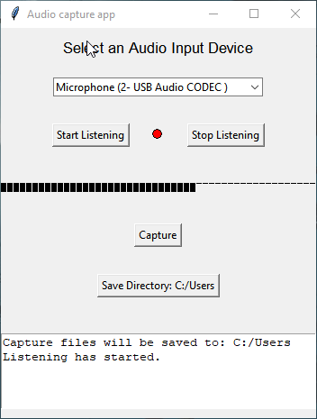
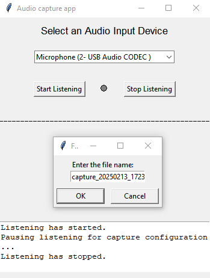

# Audio Input Capture Tool

This tool was developed to help with **organizing**, **sorting**, and **capturing improvised audio recordings**. It allows users to listen to audio input from a selected device, visualize it in real-time with a spectrometer, and easily capture short audio snippets with user-defined filenames and durations. It also provides a convenient way to manage saved captures and configure the save directory.

<br>

<p align="center">
  
  &nbsp;&nbsp;&nbsp;
  
</p>

<br>

## Features

- **Device Selection**: Easily select an input audio device from a dropdown menu.
- **Listening Control**: Start and stop audio input listening with a single click.
- **Real-Time Visualization**: Display audio levels visually using a dynamic spectrometer.
- **Audio Capture**:
  - Capture audio snippets with a custom filename.
  - Configure capture duration (1–300 seconds).
  - Avoid overwriting existing files with filename validation.
- **Save Directory Configuration**:
  - Choose a directory for saving audio captures.
  - Save the configuration persistently across sessions.
- **Error Handling**: Intuitive error messages and feedback for invalid input or missing configurations.

---

## Quick Download
For the latest `.exe` version, go to the [Releases](https://github.com/cfrBernard/audio-capture-app/releases) page.

---

## Getting Started

### Prerequisites

- **Python 3.8+**
- **Required Libraries**:
  - `tkinter`: GUI framework (comes pre-installed with Python).
  - `sounddevice`: For audio input.
  - `numpy`: For numerical operations.
  - `wave`: To save audio files in WAV format.

You can install the dependencies with the following command:

```bash
pip install -r requirements.txt
```

### Running the Application

1. Clone this repository or download the source code.
2. Open a terminal and navigate to the project directory.
3. Run the application using:

```bash
python app.py
```

## How to Use

### Selecting an Input Device

- Choose an input device from the dropdown list at the top of the application window.
- Only devices with input capabilities are listed.
- Press **Start Listening** to begin monitoring the audio input.

### Capturing Audio

1. Click the **Capture** button to open the capture configuration dialog.
2. Enter a filename (without the extension). If no filename is provided, the app generates one automatically.
3. Specify the duration of the capture (1–300 seconds).
4. The file is saved in the configured save directory.

### Managing the Save Directory

- The current save directory is displayed on the **Save Directory** button.
- Click the button to change the directory.
- The selection is saved persistently in a `config.txt` file.

### Real-Time Visualization

- A spectrometer displays the audio input levels in real-time.
- The display is dynamic and sensitive to the audio signal.

## File Structure

```bash
.
├── app.py               # Main application code
├── config.txt           # Configuration file for save directory
├── requirements.txt     # List of dependencies
├── LICENSE.md           # MIT License
└── README.md            # Documentation for the project
```

## Troubleshooting

### No Input Devices Listed:

- Ensure that your audio input device (e.g., microphone) is connected and enabled.
- Restart the application.

### Save Directory Issues:

- The app defaults to the current directory if no directory is selected.
- Ensure you have write permissions for the chosen directory.

## Future Enhancements

- Add MIDI support (for input & export). 
- Add support for stereo audio input.
- Enhance the spectrometer with frequency domain analysis.
- Implement additional audio file formats (e.g., MP3).
- Add playback functionality for captured files directly within the app.

## License

This project is licensed under the MIT License. See the LICENSE file for details.

## Author

Developed with ❤️ by [cfrBernard](https://github.com/cfrBernard) for easier organization and capture of audio improvisations.

---

**Note**: A MacOS version will be released in the future.
